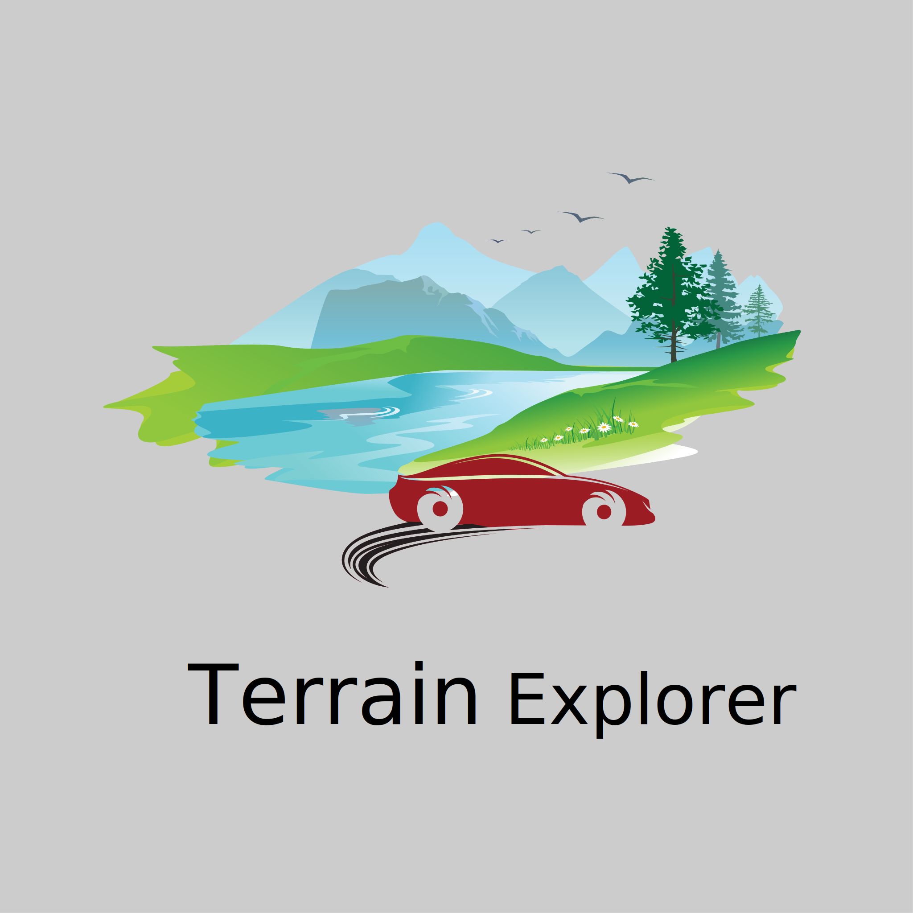

 

  

  <h3 align="center">Terrain Explorer</h3>

  

    An Awesome game created in Unity 3d for me and my friends!
     
     
    <a href="https://github.com/Kcoderhtml/TerrainExplorer"><strong>Explore the docs »</strong></a>
     
     
    <a href="https://github.com/Kcoderhtml/TerrainExplorer">View Demo</a>
    .
    <a href="https://github.com/Kcoderhtml/TerrainExplorer/issues">Report Bug</a>
    .
    <a href="https://github.com/Kcoderhtml/TerrainExplorer/issues">Request Feature</a>
  

   

## Table Of Contents

* [About the Project](#about-the-project)
* [Built With](#built-with)
* [Getting Started](#getting-started)
  * [Prerequisites](#prerequisites)
  * [Installation](#installation)
* [Usage](#usage)
* [Contributing](#contributing)
* [License](#license)
* [Authors](#authors)
* [Acknowledgements](#acknowledgements)

## About The Project

I always wanted to make a game so i decided to make this one enjoy!

## Built With

This was built with Unity3d.

## Getting Started

This is instructions on setting up your project locally.

### Prerequisites

None.

### Installation

1. Download.

2. Make Executable.

3. Play!

## Usage

You can use this project to play Terrain Explorer.

## Contributing

Contributions are what make the open source community such an amazing place to be learn, inspire, and create. Any contributions you make are **greatly appreciated**.
* If you have suggestions for adding or removing projects, feel free to [open an issue](https://github.com/Kcoderhtml/TerrainExplorer/issues/new) to discuss it, or directly create a pull request after you edit the *README.md* file with necessary changes.
* Please make sure you check your spelling and grammar.
* Create individual PR for each suggestion.
* Please also read through the [Code Of Conduct](https://github.com/Kcoderhtml/TerrainExplorer/blob/main/CODE_OF_CONDUCT.md) before posting your first idea as well.

### Creating A Pull Request

1. Fork the Project
2. Create your Feature Branch (`git checkout -b feature/AmazingFeature`)
3. Commit your Changes (`git commit -m 'Add some AmazingFeature'`)
4. Push to the Branch (`git push origin feature/AmazingFeature`)
5. Open a Pull Request

## License

Terrain Explorer © 2021 by Kieran Klukas (kcoderhtml) is licensed under [CC BY-NC-ND](https://creativecommons.org/licenses/by-nc-nd/4.0/) 4.0. See [LICENSE](https://github.com/Kcoderhtml/TerrainExplorer/blob/master/LICENSE.md) for more information.

## Authors

* **KCoderhtml** - *Middle School Student* - [KCoderhtml](https://github.com/kcoderhtml) - *Started Project.*

## Acknowledgements

* [KCoderhtml](https://github.com/kcoderhtml/)
